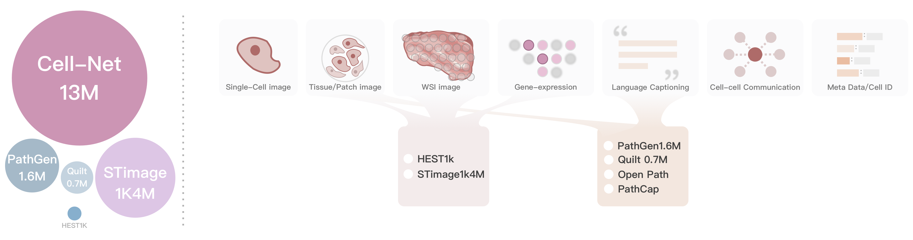
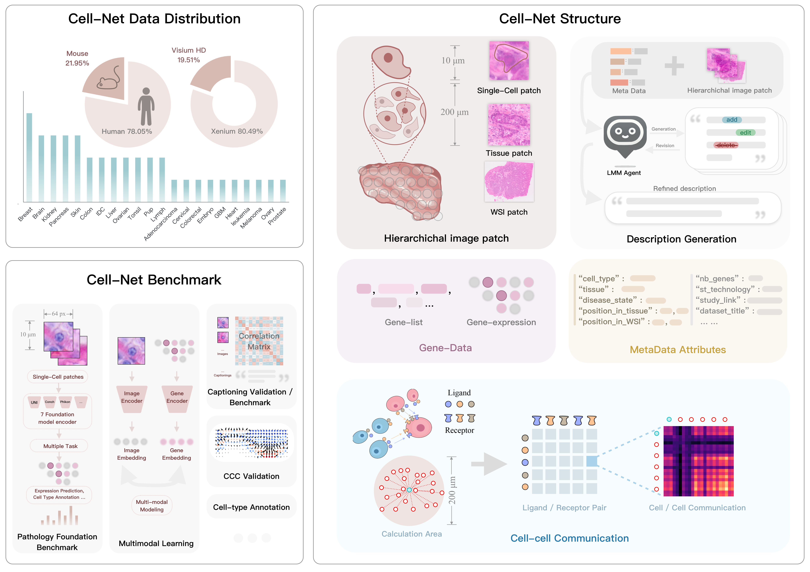

# **Cell-NET Dataset**
A large-scale multimodal dataset for single-cell analysis.



## **Overview**
**Cell-NET** is a high-resolution **multimodal single-cell dataset** comprising **14.4 million** single-cell samples. It bridges **microscopic imaging, gene expression, spatial transcriptomics, and natural language annotations**, enabling a **bottom-up, interpretable** approach to modeling biological systems.  

### 🔹 **Key Features**
- **Multi-scale imaging**: Each single-cell instance has **three hierarchical image patches**:
  - **Cell-level** (64×64 px) – Captures fine-grained morphology.
  - **Tissue-level** (200 µm window) – Provides microenvironment context.
  - **Whole-slide level** – Offers global histopathological insights.
- **Transcriptomics Data**: RNA-seq profiles capturing over **36,000 genes** per cell.
- **Spatial transcriptomics integration**: Mapping gene expression to tissue structure.
- **Cell-to-cell communication (CCC) graphs**: Infers interactions between neighboring cells.
- **Vision-Language Annotations**: Each cell has **descriptive captions** generated to summarize **morphology, tissue context, and pathology**.

---

## **📥 Download**
[🔗 Dataset Link](#) <!-- Replace with actual link when available -->

---

## **🖼️ Figures**
### **Dataset Structure**

*Figure 1: Cell-NET integrates imaging, transcriptomics, and structured metadata for multimodal single-cell analysis.*
---

## **📑 Data Structure**
The **Cell-NET** dataset is stored in an **HDF5 file**, containing structured single-cell data across multiple modalities.

```plaintext
/Cell_0001  
├── expression          # Gene expression profile (36,601 genes)
├── images             # Multi-scale image patches
│   ├── cell_patch     # Cropped cell-level image (uint8)
│   ├── tissue_patch   # Larger tissue-level image (uint8)
│   └── WSI_patch      # Whole-slide image patch (uint8)
├── attributes.json     # Structured metadata (JSON)
├── caption.txt         # Natural language description (str)
└── CCC                 # Cell-Cell Communication (sparse matrix)
```

## **🔬 Multimodal Components**
### **1️⃣ Multi-Level Imaging**
- **Cell-Level** (64×64 pixels): Captures **nuclear morphology** and fine-grained details.
- **Tissue-Level** (200 µm window): Provides **neighborhood context** of the cell.
- **WSI-Level**: Whole-slide view to integrate local and **global tissue information**.

### **2️⃣ Gene Expression Profiles**
- Derived from **10x Visium HD & Xenium platforms**.
- Gene list file includes **all detected genes** per cell.
- Expression matrix provides **log-normalized read counts**.

### **3️⃣ Cell-Cell Communication (CCC)**
- Computed using **CellChat** and **COMMOT**.
- Models **ligand-receptor interactions** within a **200 µm radius**.
- Supports **spatial organization and cellular interaction analysis**.

### **4️⃣ Language Captioning**
Each cell receives an **automatically generated caption** describing its **morphological characteristics, local environment, and potential pathology.**  
Example:
> *"The microscopic image reveals pleomorphic cells with enlarged, hyperchromatic nuclei, prominent nucleoli, eosinophilic cytoplasm, and areas of dense and sparse cellularity. Keratinization and potential intercellular bridges suggest squamous differentiation. Disorganized tissue architecture and irregular cell clustering indicate a likely squamous cell carcinoma, typically found in the head and neck region."*


## 📑 Labeled Attributes

Each cell in **Cell-NET** is annotated with structured metadata, allowing researchers to analyze multimodal relationships between **morphology, spatial context, and transcriptomics**.

| **Attribute**           | **Example Value**        |
|-------------------------|-------------------------|
| **source**              | `"Human"`               |
| **tissue**              | `"Lymph node"`          |
| **cell_type**           | `"T-cell"`              |
| **cell_disease_state**  | `"Cancer"`              |
| **tissue_disease_state**| `"Cancer"`              |
| **Position_in_tissue**  | `"(1945, 345)"`        |
| **Position_in_WSI**     | `"(893021, 398472)"`    |
| **cell_diameter**       | `"9.0 µm"`              |
| **st_technology**       | `"Visium HD"`           |


---

## **📊 Applications**
**Cell-NET** enables various downstream tasks, including:
### ✅ **1. Cell Type Classification**
- Benchmark for **single-cell vision models**.
- Supports **few-shot learning** approaches.

### ✅ **2. Gene Expression Prediction**
- Infers **gene profiles from histological images**.
- Bridges **imaging and transcriptomics**.

### ✅ **3. Spatial Domain Segmentation**
- Identifies **functional tissue regions**.
- Useful for **tumor microenvironment mapping**.

### ✅ **4. Cell-Cell Interaction Modeling**
- Analyzes **spatially-resolved signaling networks**.
- Supports **multi-modal biological modeling**.

---

## **📌 Citation**
If you use **Cell-NET**, please cite:
```bibtex
@article{cellnet2025,
  author  = {},
  title   = {Cell-NET13M: Redefining Microscopic Insights with a Multimodal Single-Cell Spatial Transcriptomics Dataset},
  journal = {Under Review},
  year    = {2025}
}

