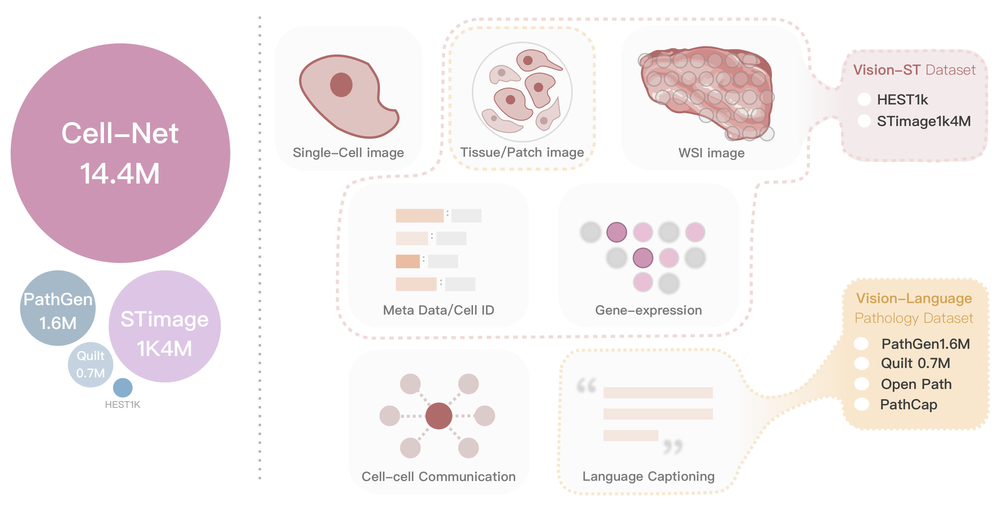

# Cell-NET Dataset
A large-scale multimodal dataset for single-cell analysis.

## Overview
Cell-NET consists of 14.4M single-cell samples, integrating:
- High-resolution microscopic images (cell, tissue, WSI)
- Gene expression profiles
- Spatial transcriptomics
- Cell-to-cell communication networks
- Natural language annotations

## Download
[Dataset Link](#)  <!-- Replace with actual link when available -->

## Figures

_Figure 1: Comparison of dataset size and modality coverage._

## Usage
