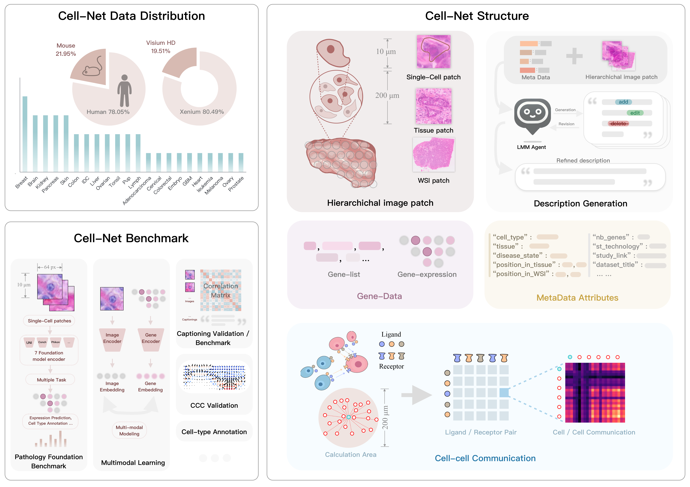

# sMMC-22M

**sMMC-22M** is a context-aware, cell-aligned multimodal dataset and benchmark for
single-cell spatial transcriptomics. The current manuscript introduces the resource as:

> **sMMC-22M: A Context-Aware Dataset and Benchmark for Single-Cell Spatial Transcriptomics**

The dataset pairs histology, molecular profiles, spatial coordinates, structured
metadata, cell-cell communication context, and language annotations at the level of
individual cells. It is designed to test whether morphology and local tissue context
can predict molecular state beyond narrow in-domain interpolation.



## Highlights

- **Scale:** 23.94M aligned single-cell records in the full release manifest.
- **Coverage:** 25 organ categories across Xenium and Visium HD data blocks.
- **Platforms:** 16.31M Xenium cells and 7.63M Visium HD bin-to-cell aligned records.
- **Resolution:** each benchmark unit is a single aligned cell rather than a mixed ST spot.
- **Context:** each cell can include histology crops, expression targets, spatial coordinates,
  sample-level metadata, neighborhood descriptors, CCC features, and captions.
- **Benchmarking:** predefined splits support in-domain, cross-patient, cross-platform,
  context-shift, encoder scaling, and ST model evaluation.

## Dataset Structure

sMMC-22M is organized around a shared cellular anchor. Each cell record links
image, omics, metadata, spatial, and optional language/context fields for the same
biological unit.

```text
cell_record/
  images/
    cell_patch              # Cell-centered morphology crop
    tissue_patch            # Local tissue context, about 200 um
    wsi_patch               # Larger whole-slide context when available
  omics/
    expression              # Xenium panel genes or processed Visium HD targets
    gene_names              # Target gene order for the expression vector
  metadata/
    cell_id
    sample_id
    study_id
    platform                # Xenium, Visium HD, or harmonized benchmark block
    species
    organ
    tissue
    cell_type
    disease_state
    position_in_tissue
    position_in_wsi
  context/
    neighborhood_features
    cell_cell_communication # Ligand-receptor or neighborhood interaction features
  language/
    caption                 # Automated morphology and microenvironment description
```

The full release is distributed as benchmark-ready blocks and manifests rather than
as a single monolithic file:

| Release block | Platform / species | Studies | Organs | Cells | Unit | Artifact |
| --- | --- | ---: | ---: | ---: | --- | --- |
| Full release | Xenium + Visium HD; human, mouse, and other species | 66 | 25 | 23.94M | Aligned single-cell record | `manifest/` |
| Xenium public block | Xenium; human and mouse | 42 | 15 | 16.31M | Platform-defined segmented cell | `xenium/*.h5ad` |
| Visium HD public block | Visium HD; human, mouse, and other species | 24 | 16 | 7.63M | 8 um bin-to-cell aligned record | `visium_hd/*.h5ad` |

## 📑 Labeled Attributes

Each cell in **sMMC-22M** is annotated with structured metadata, allowing researchers
to analyze multimodal relationships between **morphology, spatial context, and
transcriptomics**.

| **Attribute** | **Example Value** |
| --- | --- |
| **source** | `"Human"` |
| **tissue** | `"Lymph node"` |
| **cell_type** | `"T-cell"` |
| **cell_disease_state** | `"Cancer"` |
| **tissue_disease_state** | `"Cancer"` |
| **Position_in_tissue** | `"(1945, 345)"` |
| **Position_in_WSI** | `"(893021, 398472)"` |
| **cell_diameter** | `"9.0 µm"` |
| **st_technology** | `"Visium HD"` |

## Benchmarks

sMMC-22M Bench is organized around three data-centric axes:

1. **Scale:** pathology encoder benchmarking and scaling-law analysis test whether larger
   pathology foundation models improve morphology-to-gene correspondence under matched
   evaluation.
2. **Resolution:** image-to-single-cell expression prediction evaluates single-cell targets
   under strict in-domain and cross-patient splits.
3. **Rich context:** cross-platform and context-shift experiments test whether models remain
   robust under biologically meaningful changes, including sample-level shifts such as age bands.

The overview figure also summarizes benchmark families for pathology encoders, scaling-law
experiments, and spatial transcriptomics models such as STMoE, BLEEP, and Hist2ST.

## Repository Layout

```text
.
  README.md
  dataset.png
  comparison.png
  data_sample/
    *.zip                       # Lightweight per-cell image and metadata samples
    sample_captions/*.csv       # Example generated captions
  src/
    Captioning/                 # Caption generation and quality-control notebooks
    Foundation_Benchmarks/      # Encoder extraction and scaling-law evaluation scripts
```

Sample zip files contain lightweight cell-level examples. A typical extracted sample folder
contains per-cell image patches and attributes:

```text
cell_id/
  cell.tif
  patch.tif
  attributes.csv
```

## Potential Applications

- Single-cell histology-to-gene prediction
- Cross-patient and cross-platform generalization analysis
- Pathology foundation model benchmarking
- Spatial domain segmentation and tissue-state discovery
- Cell-type and disease-state classification
- Morphological phenotype analysis
- Cell-cell communication and microenvironment modeling
- Multimodal captioning and image-language evaluation

## Data Access

The full public release link will be added after release. This repository currently includes
lightweight sample files under `data_sample/` and benchmark/captioning code under `src/`.

Users must follow the license terms of the source studies and should not attempt to
re-identify patients or derive protected health information from the data.

## Citation

If you use this dataset or benchmark, please cite the manuscript:

```bibtex
@misc{smmc22m2026,
  title  = {sMMC-22M: A Context-Aware Dataset and Benchmark for Single-Cell Spatial Transcriptomics},
  author = {Anonymous},
  note   = {Submitted to NeurIPS 2026},
  year   = {2026}
}
```

## License

See [LICENSE](LICENSE) for repository license terms. Source datasets may have additional
license and usage constraints; check the release manifest before redistribution or downstream use.
